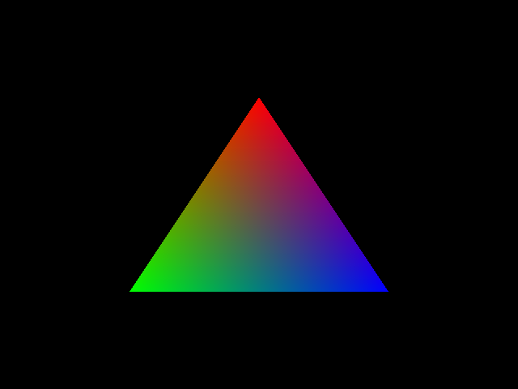

# Learning OpenGL

| [](https://github.com/faresbakhit/gl/blob/3852f0ad22552fa71309d6abbf4e9ab345ff7e8c/lib/window.cxx) | [](https://github.com/faresbakhit/gl/blob/104f05d64e325469baeaa1b94c1d074268dfcd42/bin/cube.cpp) |
| - | -|

This repository documents my journey of (hopefully) learning graphics programming. The textbook I'm reading is V. Scott Gordon, and John Clevenger, _Computer Graphics Programming in OpenGL with C++_, for more information see [references](#references).

I'm using C++23 with [modules](https://en.cppreference.com/w/cpp/language/modules.html), the [CMake](https://cmake.org) build system, and the [vcpkg](https://github.com/microsoft/vcpkg) package manager. Dependencies include but not limited to: [GLFW](https://www.glfw.org/), [GLEW](https://glew.sourceforge.net/), and [GLM](https://github.com/g-truc/glm).

## Building

1. Install CMake 3.28 or newer
2. [Set up vcpkg](https://learn.microsoft.com/en-us/vcpkg/)
3. Clone the repository and build the project

```sh
git clone http://github.com/faresbakhit/gl && cd gl
cmake --preset release
cmake --build --preset release
```

## References

1. V. Scott Gordon, and John Clevenger, _Computer Graphics Programming in OpenGL with C++_, 3rd ed. (Mercury Learning & Information, 2024).
